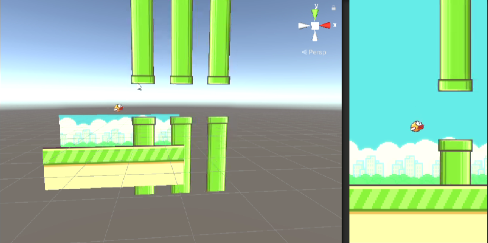

# Unity_Flappybird

## About
This is a flappy bird clone which is built with Unity and written in C#. This project aims to recreate the addictive and challenging gameplay of the original Flappy Bird game, where the player controls a bird and attempts to navigate it through a series of pipes without colliding.


## Installation
To run the Flappy Bird clone on your local machine, follow these steps:
```
1. Clone the repository or download the source code as a ZIP file.
2. Open Unity and navigate to the project folder.
3. Open the project in Unity by selecting the folder and clicking "Open."
4. Once the project is open, navigate to the "Scenes" folder and open the "Main" scene.
5. Connect a supported platform (such as your mobile device or Unity's Play Mode) to run the game.
6. Build and run the project.
```
